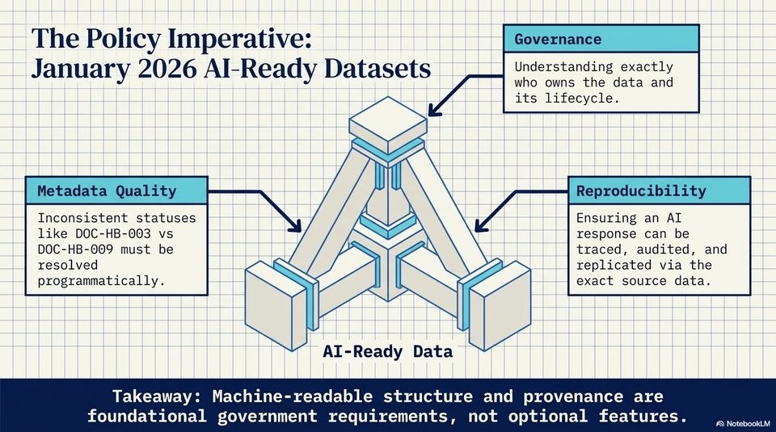

<!-- Generated by research/hmrc-beyond-hype/tools/build_narrative_sidecars.py. -->
---
source_id: challenge-2-unlocking-dark-data
source_file: "research/hmrc-beyond-hype/import/Challenge_2_Unlocking_Dark_Data.pptx"
item_type: pptx-slide
item_number: 9
asset: "assets/visuals/challenge-2-unlocking-dark-data/slide-09.jpg"
publication_status: "publishable derived thumbnail and text sidecar; raw imported PowerPoint remains local"
tags:
  - auditability
  - challenge-2
  - dark-data
  - governance
  - provenance
  - source-backed-answers
  - talk-demo
---

# Challenge 2 Unlocking Dark Data - Slide 09



## Visual Description

This is slide 09 from `research/hmrc-beyond-hype/import/Challenge_2_Unlocking_Dark_Data.pptx`. It is represented here by a small derived image so the narrative can be browsed on GitHub without publishing the raw import file.

## Claim Or Narrative Function

Frames the public-sector problem: guidance can exist but still be hard to find, structure, trust, and reuse as evidence-backed answers.

## Material Points Illustrated

- The Policy Imperative: jovernance
- January 2026 Al-Ready Datasets Wileesbacctanig eee tely
- who owns the data and
- its lifecycle.
- Inconsistent statuses Ensuring an AL
- like DOC-HB-003 vs response can be
- DOC-HB-009 must be traced, audited, and
- resolved replicated via the
- programmatically. exact source data.
- AI-Ready Data
- Takeaway: Machine-readable structure and provenance are
- foundational government requirements, not optional features. - , \couw

## Related Narrative Links

- [Narrative arc](../../narrative-arc.md)
- [Topic index](../../topics.md)
- [Source material index](../../source-materials.md)
- [06 Repo Case Study Codex Build](../../../06_repo_case_study_codex_build.md)
- [Engineering Accountability In Public Sector Ai.Speakers](../../../transcripts/engineering-accountability-in-public-sector-ai.speakers.md)
- [Workbench](../../../../../challenge-2/wiki/workbench.md)

## Publication Status

publishable derived thumbnail and text sidecar; raw imported PowerPoint remains local.

## Caveats

- Automated OCR from an image-only PowerPoint slide; verify exact wording before quoting.

## Extracted Visual Text

```text
The Policy Imperative: jovernance
January 2026 Al-Ready Datasets Wileesbacctanig eee tely
who owns the data and
its lifecycle.
Inconsistent statuses Ensuring an AL
like DOC-HB-003 vs response can be
DOC-HB-009 must be traced, audited, and
resolved replicated via the
programmatically. exact source data.
AI-Ready Data
Takeaway: Machine-readable structure and provenance are
foundational government requirements, not optional features. - , \couw
```
