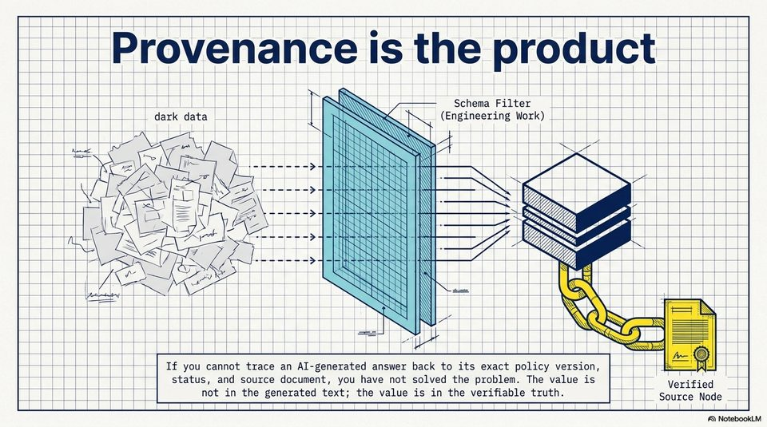

<!-- Generated by research/hmrc-beyond-hype/tools/build_narrative_sidecars.py. -->
---
source_id: challenge-2-unlocking-dark-data
source_file: "research/hmrc-beyond-hype/import/Challenge_2_Unlocking_Dark_Data.pptx"
item_type: pptx-slide
item_number: 10
asset: "assets/visuals/challenge-2-unlocking-dark-data/slide-10.jpg"
publication_status: "publishable derived thumbnail and text sidecar; raw imported PowerPoint remains local"
tags:
  - auditability
  - challenge-2
  - dark-data
  - documentation
  - governance
  - provenance
  - review
  - source-backed-answers
  - talk-demo
---

# Challenge 2 Unlocking Dark Data - Slide 10



## Visual Description

This is slide 10 from `research/hmrc-beyond-hype/import/Challenge_2_Unlocking_Dark_Data.pptx`. It is represented here by a small derived image so the narrative can be browsed on GitHub without publishing the raw import file.

## Claim Or Narrative Function

Frames the public-sector problem: guidance can exist but still be hard to find, structure, trust, and reuse as evidence-backed answers.

## Material Points Illustrated

- rFrovenance is the proaquct
- ee so | | } N \" Schema Filter Iaaa IE
- dark data Od YS (Engineering Work) Lat es Lh
- iz Se Lk [IRF 4 eee a | NINN IM | (ea aa EI el
- i plo > i ISRSRARSRNS ETN NN y [el lal
- Vex |= Be S17 777? RST IN Up ae
- a AS\ t-=] cae 4 A STH JNU Gree | {
- a > + NH LPR
- BEE Aes > SSN Cj (SENSE
- CSAS AAS TT TEREST TA K eee
- i =r a SSN |] oo ov laa al
- J IY
- ealea aula leatisisteets If you cannot trace an AI-generated answer back to its exact policy version, T | = R| iaaln
- AI T status, and source document, you have not solved the problem. The value is T Verified T
- El a | | el I not in the generated text; the value is in the verifiable truth. | | Source Node I
- A) NotebookLM


## Related Narrative Links

- [Narrative arc](../../narrative-arc.md)
- [Topic index](../../topics.md)
- [Source material index](../../source-materials.md)
- [06 Repo Case Study Codex Build](../../../06_repo_case_study_codex_build.md)
- [Engineering Accountability In Public Sector Ai.Speakers](../../../transcripts/engineering-accountability-in-public-sector-ai.speakers.md)
- [Workbench](../../../../../challenge-2/wiki/workbench.md)

## Publication Status

publishable derived thumbnail and text sidecar; raw imported PowerPoint remains local.

## Caveats

- Automated OCR from an image-only PowerPoint slide; verify exact wording before quoting.

## Extracted Visual Text

```text
~ rFrovenance is the proaquct
ee so | | } N \" Schema Filter Iaaa IE
| dark data Od YS (Engineering Work) Lat es Lh
iz Se Lk [IRF 4 eee a | NINN IM | (ea aa EI el
i plo > i ISRSRARSRNS ETN NN y [el lal
Vex |= Be S17 777? RST IN Up ae
a AS\ t-=] cae 4 A STH JNU Gree | {
a > + NH LPR |
BEE Aes > SSN Cj (SENSE
CSAS AAS TT TEREST TA K eee
| i =r a SSN |] oo ov laa al
| J IY |
\ealea aula leatisisteets If you cannot trace an AI-generated answer back to its exact policy version, T | = R| iaaln
AI T status, and source document, you have not solved the problem. The value is T Verified T
| El a | | el I not in the generated text; the value is in the verifiable truth. | | Source Node I
A) NotebookLM
```
