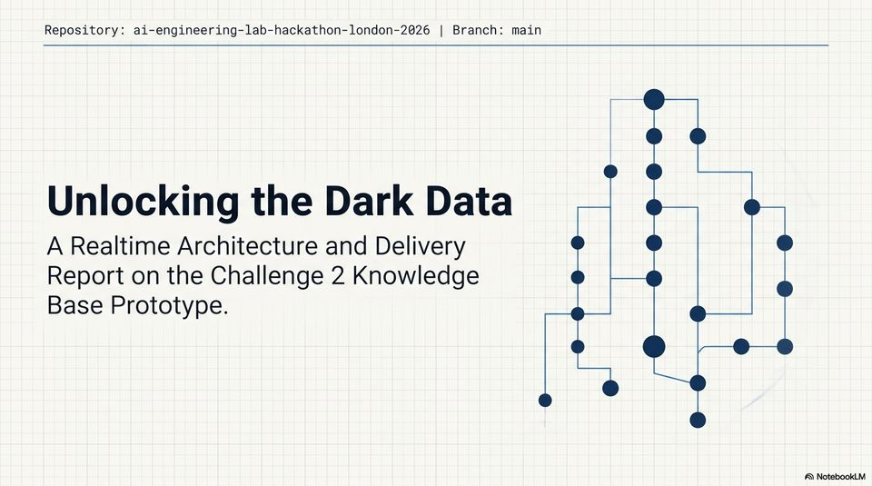

<!-- Generated by research/hmrc-beyond-hype/tools/build_narrative_sidecars.py. -->
---
source_id: dark-data-blueprint
source_file: "research/hmrc-beyond-hype/import/Dark_Data_Blueprint.pptx"
item_type: pptx-slide
item_number: 1
asset: "assets/visuals/dark-data-blueprint/slide-01.jpg"
publication_status: "publishable derived thumbnail and text sidecar; raw imported PowerPoint remains local"
tags:
  - auditability
  - challenge-2
  - dark-data
  - mcp
  - provenance
  - review
  - traceability
---

# Dark Data Blueprint - Slide 01



## Visual Description

This is slide 01 from `research/hmrc-beyond-hype/import/Dark_Data_Blueprint.pptx`. It is represented here by a small derived image so the narrative can be browsed on GitHub without publishing the raw import file.

## Claim Or Narrative Function

Explains the Challenge 2 architecture and why provenance, source preservation, and inspectable Markdown traces matter more than fluent answers alone.

## Material Points Illustrated

- Repository: ai-engineering-lab-hackathon-london-2026 | Branch: main
- Unlocking the Dark Data
- A Realtime Architecture and Delivery
- Report on the Challenge 2 Knowledge
- Base Prototype.


## Related Narrative Links

- [Narrative arc](../../narrative-arc.md)
- [Topic index](../../topics.md)
- [Source material index](../../source-materials.md)
- [06 Repo Case Study Codex Build](../../../06_repo_case_study_codex_build.md)
- [Architecture](../../../../../challenge-2/wiki/architecture.md)
- [Index](../../../../../challenge-2/wiki/index.md)

## Publication Status

publishable derived thumbnail and text sidecar; raw imported PowerPoint remains local.

## Caveats

- Automated OCR from an image-only PowerPoint slide; verify exact wording before quoting.

## Extracted Visual Text

```text
Repository: ai-engineering-lab-hackathon-london-2026 | Branch: main
Unlocking the Dark Data
A Realtime Architecture and Delivery
Report on the Challenge 2 Knowledge
Base Prototype.
```
