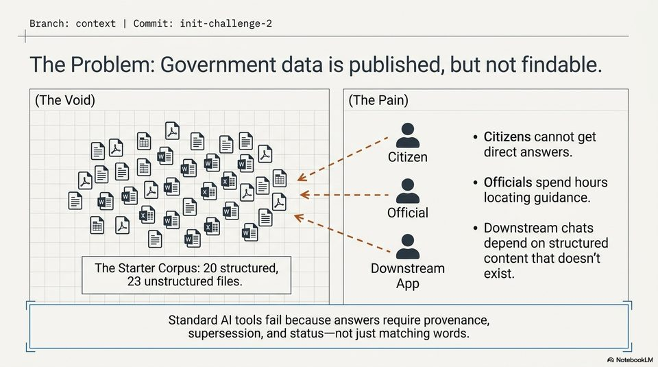

<!-- Generated by research/hmrc-beyond-hype/tools/build_narrative_sidecars.py. -->
---
source_id: dark-data-blueprint
source_file: "research/hmrc-beyond-hype/import/Dark_Data_Blueprint.pptx"
item_type: pptx-slide
item_number: 2
asset: "assets/visuals/dark-data-blueprint/slide-02.jpg"
publication_status: "publishable derived thumbnail and text sidecar; raw imported PowerPoint remains local"
tags:
  - auditability
  - challenge-2
  - dark-data
  - mcp
  - provenance
  - review
  - traceability
---

# Dark Data Blueprint - Slide 02



## Visual Description

This is slide 02 from `research/hmrc-beyond-hype/import/Dark_Data_Blueprint.pptx`. It is represented here by a small derived image so the narrative can be browsed on GitHub without publishing the raw import file.

## Claim Or Narrative Function

Explains the Challenge 2 architecture and why provenance, source preservation, and inspectable Markdown traces matter more than fluent answers alone.

## Material Points Illustrated

- Branch: context | Commit: init-challenge-2
- The Problem: Government data is published, but not findable.
- The Void) (The Pain)
- e) - Citizens cannot get
- B aw Bam iizen direct answers.
- B 2 > aa
- ae e = r ) * Officials spend hours
- G <= ------ gS locating guidance.
- Official
- Downstream chats
- a @ depend on structured
- content that doesn't
- The Starter Corpus: 20 structured, Downstream exist
- 23 unstructured files. App ;
- Standard Al tools fail because answers require provenance,
- supersession, and status-not just matching words.
- A\ NotebookLV


## Related Narrative Links

- [Narrative arc](../../narrative-arc.md)
- [Topic index](../../topics.md)
- [Source material index](../../source-materials.md)
- [06 Repo Case Study Codex Build](../../../06_repo_case_study_codex_build.md)
- [Architecture](../../../../../challenge-2/wiki/architecture.md)
- [Index](../../../../../challenge-2/wiki/index.md)

## Publication Status

publishable derived thumbnail and text sidecar; raw imported PowerPoint remains local.

## Caveats

- Automated OCR from an image-only PowerPoint slide; verify exact wording before quoting.

## Extracted Visual Text

```text
Branch: context | Commit: init-challenge-2
NER
The Problem: Government data is published, but not findable.
(The Void) (The Pain)
e) - Citizens cannot get
B aw Bam iizen direct answers.
B 2 > aa
ae e = r ) * Officials spend hours
G <= ------ gS locating guidance.
<< Official
= Downstream chats
a @ depend on structured
) content that doesn't
The Starter Corpus: 20 structured, Downstream exist
23 unstructured files. App ;
Standard Al tools fail because answers require provenance,
supersession, and status-not just matching words.
iL =|
'A\ NotebookLV
```
