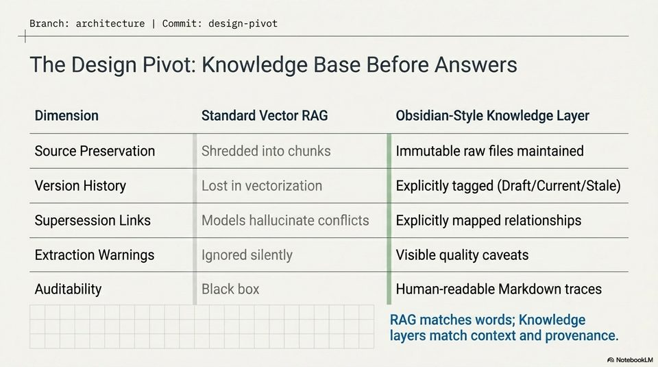

<!-- Generated by research/hmrc-beyond-hype/tools/build_narrative_sidecars.py. -->
---
source_id: dark-data-blueprint
source_file: "research/hmrc-beyond-hype/import/Dark_Data_Blueprint.pptx"
item_type: pptx-slide
item_number: 3
asset: "assets/visuals/dark-data-blueprint/slide-03.jpg"
publication_status: "publishable derived thumbnail and text sidecar; raw imported PowerPoint remains local"
tags:
  - auditability
  - challenge-2
  - dark-data
  - design
  - evaluation
  - mcp
  - operations
  - provenance
  - review
  - traceability
---

# Dark Data Blueprint - Slide 03



## Visual Description

This is slide 03 from `research/hmrc-beyond-hype/import/Dark_Data_Blueprint.pptx`. It is represented here by a small derived image so the narrative can be browsed on GitHub without publishing the raw import file.

## Claim Or Narrative Function

Explains the Challenge 2 architecture and why provenance, source preservation, and inspectable Markdown traces matter more than fluent answers alone.

## Material Points Illustrated

- Branch: architecture | Commit: design-pivot
- The Design Pivot: Knowledge Base Before Answers
- Dimension Standard Vector RAG Obsidian-Style Knowledge Layer
- Source Preservation Shredded into chunks | Immutable raw files maintained
- Version History Lost in vectorization ; Explicitly tagged (Draft/Current/Stale)
- Supersession Links Models hallucinate conflicts | Explicitly mapped relationships
- Extraction Warnings Ignored silently Visible quality caveats
- Auditability Black box | Human-readable Markdown traces
- RAG matches words; Knowledge
- layers match context and provenance.


## Related Narrative Links

- [Narrative arc](../../narrative-arc.md)
- [Topic index](../../topics.md)
- [Source material index](../../source-materials.md)
- [06 Repo Case Study Codex Build](../../../06_repo_case_study_codex_build.md)
- [Architecture](../../../../../challenge-2/wiki/architecture.md)
- [Index](../../../../../challenge-2/wiki/index.md)
- [Challenge 2 worked example](../../notes/challenge-2-worked-example.md)

## Publication Status

publishable derived thumbnail and text sidecar; raw imported PowerPoint remains local.

## Caveats

- Automated OCR from an image-only PowerPoint slide; verify exact wording before quoting.

## Extracted Visual Text

```text
Branch: architecture | Commit: design-pivot
The Design Pivot: Knowledge Base Before Answers
Dimension Standard Vector RAG Obsidian-Style Knowledge Layer
Source Preservation Shredded into chunks | Immutable raw files maintained
Version History Lost in vectorization ; Explicitly tagged (Draft/Current/Stale)
Supersession Links Models hallucinate conflicts | Explicitly mapped relationships
Extraction Warnings Ignored silently Visible quality caveats
Auditability Black box | Human-readable Markdown traces
RAG matches words; Knowledge
layers match context and provenance.
```
