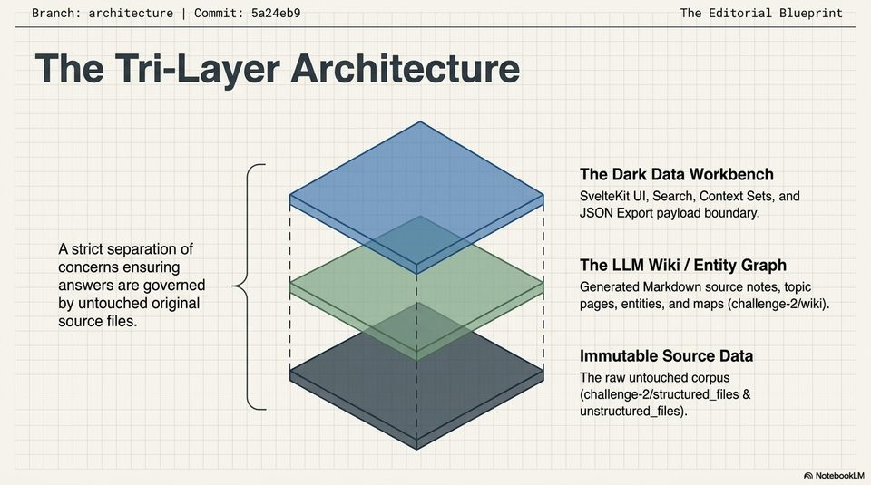

<!-- Generated by research/hmrc-beyond-hype/tools/build_narrative_sidecars.py. -->
---
source_id: dark-data-blueprint
source_file: "research/hmrc-beyond-hype/import/Dark_Data_Blueprint.pptx"
item_type: pptx-slide
item_number: 4
asset: "assets/visuals/dark-data-blueprint/slide-04.jpg"
publication_status: "publishable derived thumbnail and text sidecar; raw imported PowerPoint remains local"
tags:
  - auditability
  - challenge-2
  - dark-data
  - mcp
  - provenance
  - review
  - risk-boundaries
  - traceability
---

# Dark Data Blueprint - Slide 04



## Visual Description

This is slide 04 from `research/hmrc-beyond-hype/import/Dark_Data_Blueprint.pptx`. It is represented here by a small derived image so the narrative can be browsed on GitHub without publishing the raw import file.

## Claim Or Narrative Function

Explains the Challenge 2 architecture and why provenance, source preservation, and inspectable Markdown traces matter more than fluent answers alone.

## Material Points Illustrated

- Branch: architecture | Commit: 5a24eb9 The Editorial Blueprint
- The Tri-Layer Architecture
- The Dark Data Workbench
- SvelteKit UI, Search, Context Sets, and
- j 1 JSON Export payload boundary.
- Astrict separation of | 1
- concerns ensuring | ' The LLM Wiki / Entity Graph
- answers are governed Generated Markdown source notes, topic
- by untouched original { 1 pages, entities, and maps (challenge-2/wiki).
- source files. H I
- Immutable Source Data
- The raw untouched corpus
- challenge-2/structured_files &
- unstructured_files).
- A\ NotebookLV


## Related Narrative Links

- [Narrative arc](../../narrative-arc.md)
- [Topic index](../../topics.md)
- [Source material index](../../source-materials.md)
- [06 Repo Case Study Codex Build](../../../06_repo_case_study_codex_build.md)
- [Architecture](../../../../../challenge-2/wiki/architecture.md)
- [Index](../../../../../challenge-2/wiki/index.md)

## Publication Status

publishable derived thumbnail and text sidecar; raw imported PowerPoint remains local.

## Caveats

- Automated OCR from an image-only PowerPoint slide; verify exact wording before quoting.

## Extracted Visual Text

```text
Branch: architecture | Commit: 5a24eb9 The Editorial Blueprint
. .
The Tri-Layer Architecture
The Dark Data Workbench
SvelteKit UI, Search, Context Sets, and
j 1 JSON Export payload boundary.
| 1
Astrict separation of | 1
concerns ensuring | ' The LLM Wiki / Entity Graph
answers are governed Generated Markdown source notes, topic
by untouched original { 1 pages, entities, and maps (challenge-2/wiki).
source files. H I
| 1
! ! Immutable Source Data
The raw untouched corpus
(challenge-2/structured_files &
unstructured_files).
'A\ NotebookLV
```
