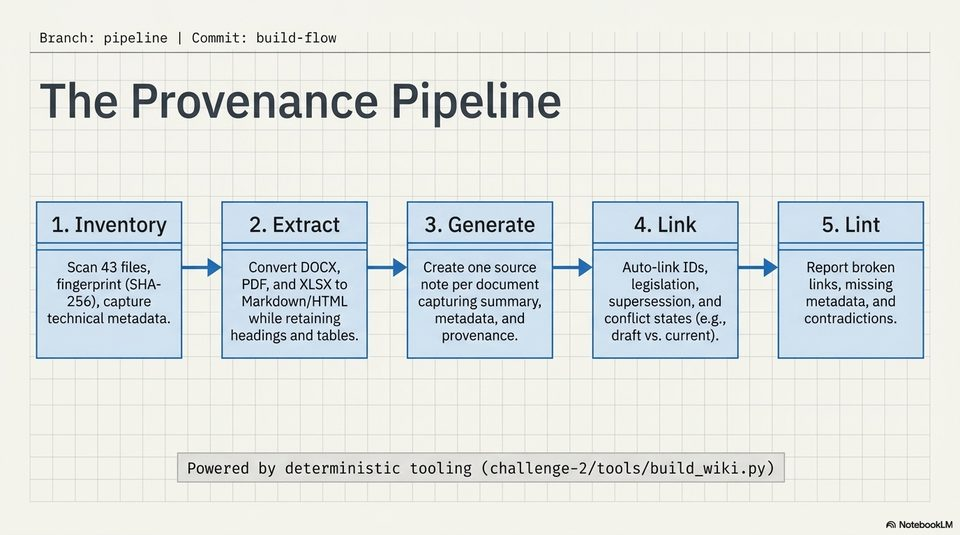

<!-- Generated by research/hmrc-beyond-hype/tools/build_narrative_sidecars.py. -->
---
source_id: dark-data-blueprint
source_file: "research/hmrc-beyond-hype/import/Dark_Data_Blueprint.pptx"
item_type: pptx-slide
item_number: 5
asset: "assets/visuals/dark-data-blueprint/slide-05.jpg"
publication_status: "publishable derived thumbnail and text sidecar; raw imported PowerPoint remains local"
tags:
  - auditability
  - build
  - challenge-2
  - dark-data
  - documentation
  - mcp
  - provenance
  - review
  - traceability
  - validation
---

# Dark Data Blueprint - Slide 05



## Visual Description

This is slide 05 from `research/hmrc-beyond-hype/import/Dark_Data_Blueprint.pptx`. It is represented here by a small derived image so the narrative can be browsed on GitHub without publishing the raw import file.

## Claim Or Narrative Function

Explains the Challenge 2 architecture and why provenance, source preservation, and inspectable Markdown traces matter more than fluent answers alone.

## Material Points Illustrated

- Branch: pipeline | Commit: build-flow
- The Provenance Pipeline
- 1. Inventory 2. Extract 3. Generate 4. Link 5. Lint
- sl ey I ee ee
- Scan 43 files, Convert DOCX, Create one source Auto-link IDs, Report broken
- fingerprint (SHA- PDF, and XLSX to note per document legislation, links, missing
- 256), capture Markdown/HTML capturing summary, supersession, and metadata, and
- technical metadata. while retaining metadata, and conflict states (e.g., contradictions.
- headings and tables. provenance. draft vs. current).
- Powered by deterministic tooling (challenge-2/tools/build_wiki.py)
- A) NotebookLM


## Related Narrative Links

- [Narrative arc](../../narrative-arc.md)
- [Topic index](../../topics.md)
- [Source material index](../../source-materials.md)
- [06 Repo Case Study Codex Build](../../../06_repo_case_study_codex_build.md)
- [Architecture](../../../../../challenge-2/wiki/architecture.md)
- [Index](../../../../../challenge-2/wiki/index.md)

## Publication Status

publishable derived thumbnail and text sidecar; raw imported PowerPoint remains local.

## Caveats

- Automated OCR from an image-only PowerPoint slide; verify exact wording before quoting.

## Extracted Visual Text

```text
Branch: pipeline | Commit: build-flow
The Provenance Pipeline
1. Inventory 2. Extract 3. Generate 4. Link 5. Lint
sl ey I ee ee
Scan 43 files, Convert DOCX, Create one source Auto-link IDs, Report broken
fingerprint (SHA- PDF, and XLSX to note per document legislation, links, missing
256), capture Markdown/HTML capturing summary, supersession, and metadata, and
technical metadata. while retaining metadata, and conflict states (e.g., contradictions.
headings and tables. provenance. draft vs. current).
Powered by deterministic tooling (challenge-2/tools/build_wiki.py)
A) NotebookLM
```
