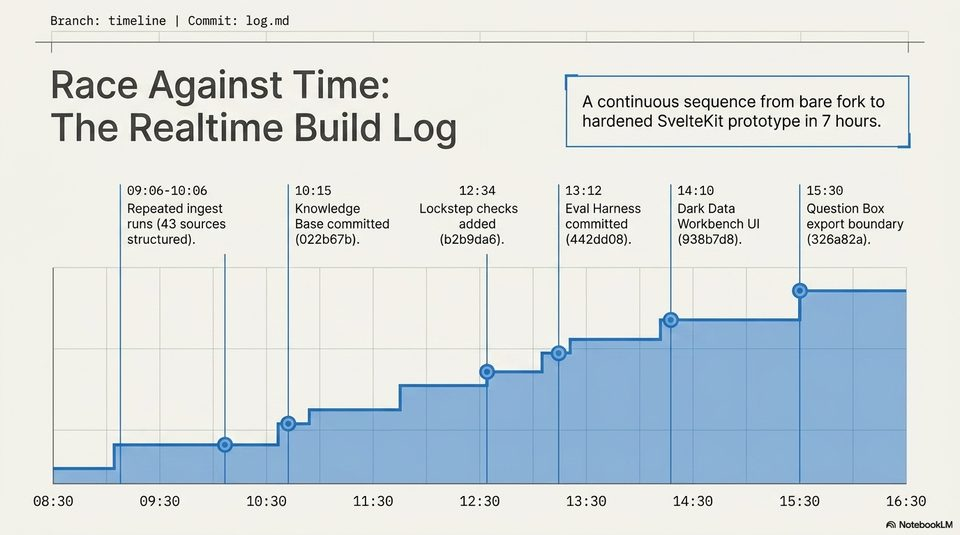

<!-- Generated by research/hmrc-beyond-hype/tools/build_narrative_sidecars.py. -->
---
source_id: dark-data-blueprint
source_file: "research/hmrc-beyond-hype/import/Dark_Data_Blueprint.pptx"
item_type: pptx-slide
item_number: 6
asset: "assets/visuals/dark-data-blueprint/slide-06.jpg"
publication_status: "publishable derived thumbnail and text sidecar; raw imported PowerPoint remains local"
tags:
  - auditability
  - challenge-2
  - dark-data
  - evaluation
  - mcp
  - provenance
  - review
  - risk-boundaries
  - traceability
  - validation
---

# Dark Data Blueprint - Slide 06



## Visual Description

This is slide 06 from `research/hmrc-beyond-hype/import/Dark_Data_Blueprint.pptx`. It is represented here by a small derived image so the narrative can be browsed on GitHub without publishing the raw import file.

## Claim Or Narrative Function

Explains the Challenge 2 architecture and why provenance, source preservation, and inspectable Markdown traces matter more than fluent answers alone.

## Material Points Illustrated

- Branch: timeline | Commit: log.md
- Race Against Time:
- A continuous sequence from bare fork to
- The Rea Iti me BUi Id Log hardened SvelteKit prototype in 7 hours.
- 09:06-10:06 10:15 12:34 alg}gal 14:10 5 )30)
- Repeated ingest Knowledge Lockstep checks Eval Harness Dark Data Question Box
- runs (43 sources Base committed added committed Workbench UI export boundary
- structured). (022b67b). (b2b9da6). (442dd08). (938b7d8). (326a82a).
- A) NotebookLM


## Related Narrative Links

- [Narrative arc](../../narrative-arc.md)
- [Topic index](../../topics.md)
- [Source material index](../../source-materials.md)
- [06 Repo Case Study Codex Build](../../../06_repo_case_study_codex_build.md)
- [Architecture](../../../../../challenge-2/wiki/architecture.md)
- [Index](../../../../../challenge-2/wiki/index.md)

## Publication Status

publishable derived thumbnail and text sidecar; raw imported PowerPoint remains local.

## Caveats

- Automated OCR from an image-only PowerPoint slide; verify exact wording before quoting.

## Extracted Visual Text

```text
Branch: timeline | Commit: log.md
a
Race Against Time:
A continuous sequence from bare fork to
The Rea Iti me BUi Id Log hardened SvelteKit prototype in 7 hours.
09:06-10:06 10:15 12:34 alg}gal 14:10 5 )30)
Repeated ingest Knowledge Lockstep checks Eval Harness Dark Data Question Box
runs (43 sources Base committed added committed Workbench UI export boundary
structured). (022b67b). (b2b9da6). (442dd08). (938b7d8). (326a82a).
|
08:30 09:30 10:30 11:30 12:30 13:30 14:30 15:30 16:30
A) NotebookLM
```
