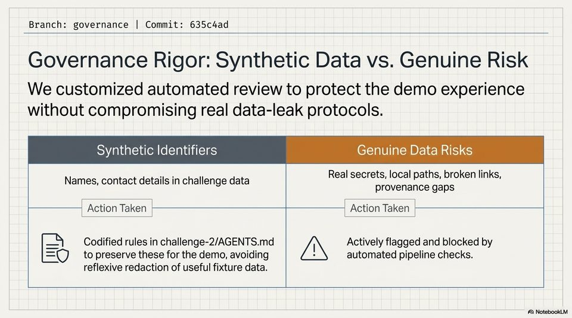

<!-- Generated by research/hmrc-beyond-hype/tools/build_narrative_sidecars.py. -->
---
source_id: dark-data-blueprint
source_file: "research/hmrc-beyond-hype/import/Dark_Data_Blueprint.pptx"
item_type: pptx-slide
item_number: 7
asset: "assets/visuals/dark-data-blueprint/slide-07.jpg"
publication_status: "publishable derived thumbnail and text sidecar; raw imported PowerPoint remains local"
tags:
  - agentic-coding
  - auditability
  - challenge-2
  - dark-data
  - governance
  - mcp
  - provenance
  - review
  - risk-boundaries
  - rollout
  - traceability
  - validation
---

# Dark Data Blueprint - Slide 07



## Visual Description

This is slide 07 from `research/hmrc-beyond-hype/import/Dark_Data_Blueprint.pptx`. It is represented here by a small derived image so the narrative can be browsed on GitHub without publishing the raw import file.

## Claim Or Narrative Function

Explains the Challenge 2 architecture and why provenance, source preservation, and inspectable Markdown traces matter more than fluent answers alone.

## Material Points Illustrated

- Branch: governance | Commit: 635c4ad
- Governance Rigor: Synthetic Data vs. Genuine Risk
- We customized automated review to protect the demo experience
- without compromising real data-leak protocols.
- Synthetic Identifiers Genuine Data Risks
- an Real secrets, local paths, broken links,
- Names, contact details in challenge data provenance gaps
- Action Taken Action Taken
- Codified rules in challenge-2/AGENTS.md / , Actively flagged and blocked by
- O to preserve these for the demo, avoiding automated pipeline checks.
- reflexive redaction of useful fixture data.


## Related Narrative Links

- [Narrative arc](../../narrative-arc.md)
- [Topic index](../../topics.md)
- [Source material index](../../source-materials.md)
- [06 Repo Case Study Codex Build](../../../06_repo_case_study_codex_build.md)
- [Architecture](../../../../../challenge-2/wiki/architecture.md)
- [Index](../../../../../challenge-2/wiki/index.md)
- [Challenge 2 worked example](../../notes/challenge-2-worked-example.md)

## Publication Status

publishable derived thumbnail and text sidecar; raw imported PowerPoint remains local.

## Caveats

- Automated OCR from an image-only PowerPoint slide; verify exact wording before quoting.

## Extracted Visual Text

```text
Branch: governance | Commit: 635c4ad
Governance Rigor: Synthetic Data vs. Genuine Risk
We customized automated review to protect the demo experience
without compromising real data-leak protocols.
Synthetic Identifiers Genuine Data Risks
an Real secrets, local paths, broken links,
Names, contact details in challenge data provenance gaps
Action Taken Action Taken
= Codified rules in challenge-2/AGENTS.md / , Actively flagged and blocked by
=O to preserve these for the demo, avoiding automated pipeline checks.
reflexive redaction of useful fixture data.
```
