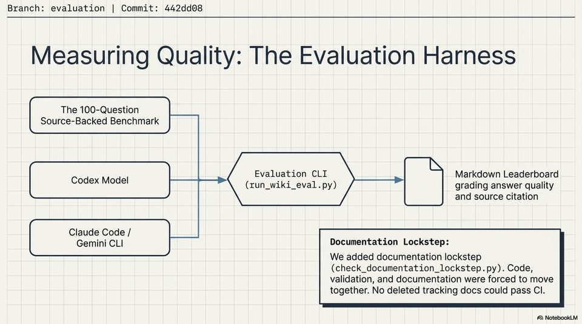

<!-- Generated by research/hmrc-beyond-hype/tools/build_narrative_sidecars.py. -->
---
source_id: dark-data-blueprint
source_file: "research/hmrc-beyond-hype/import/Dark_Data_Blueprint.pptx"
item_type: pptx-slide
item_number: 8
asset: "assets/visuals/dark-data-blueprint/slide-08.jpg"
publication_status: "publishable derived thumbnail and text sidecar; raw imported PowerPoint remains local"
tags:
  - ai-assistants
  - auditability
  - build
  - challenge-2
  - dark-data
  - documentation
  - evaluation
  - mcp
  - provenance
  - traceability
  - validation
---

# Dark Data Blueprint - Slide 08



## Visual Description

This is slide 08 from `research/hmrc-beyond-hype/import/Dark_Data_Blueprint.pptx`. It is represented here by a small derived image so the narrative can be browsed on GitHub without publishing the raw import file.

## Claim Or Narrative Function

Explains the Challenge 2 architecture and why provenance, source preservation, and inspectable Markdown traces matter more than fluent answers alone.

## Material Points Illustrated

- Branch: evaluation | Commit: 442dd08
- Measuring Quality: The Evaluation Harness
- The 100-Question
- Source-Backed Benchmark
- codenNodel Evaluation CLI Markdown Leaderboard
- us (run_wiki_eval.py) grading answer quality
- and source citation
- Claude Code /
- Gemini CLI Documentation Lockstep:
- We added documentation lockstep
- check_documentation_lockstep. py). Code,
- validation, and documentation were forced to move
- together. No deleted tracking docs could pass Cl.
- A\ NotebookLV


## Related Narrative Links

- [Narrative arc](../../narrative-arc.md)
- [Topic index](../../topics.md)
- [Source material index](../../source-materials.md)
- [06 Repo Case Study Codex Build](../../../06_repo_case_study_codex_build.md)
- [Architecture](../../../../../challenge-2/wiki/architecture.md)
- [Index](../../../../../challenge-2/wiki/index.md)

## Publication Status

publishable derived thumbnail and text sidecar; raw imported PowerPoint remains local.

## Caveats

- Automated OCR from an image-only PowerPoint slide; verify exact wording before quoting.

## Extracted Visual Text

```text
Branch: evaluation | Commit: 442dd08
Measuring Quality: The Evaluation Harness
The 100-Question
Source-Backed Benchmark
: AS
codenNodel Evaluation CLI Markdown Leaderboard
us (run_wiki_eval.py) grading answer quality
and source citation
Claude Code /
Gemini CLI Documentation Lockstep:
We added documentation lockstep
(check_documentation_lockstep. py). Code,
validation, and documentation were forced to move
together. No deleted tracking docs could pass Cl.
'A\ NotebookLV
```
