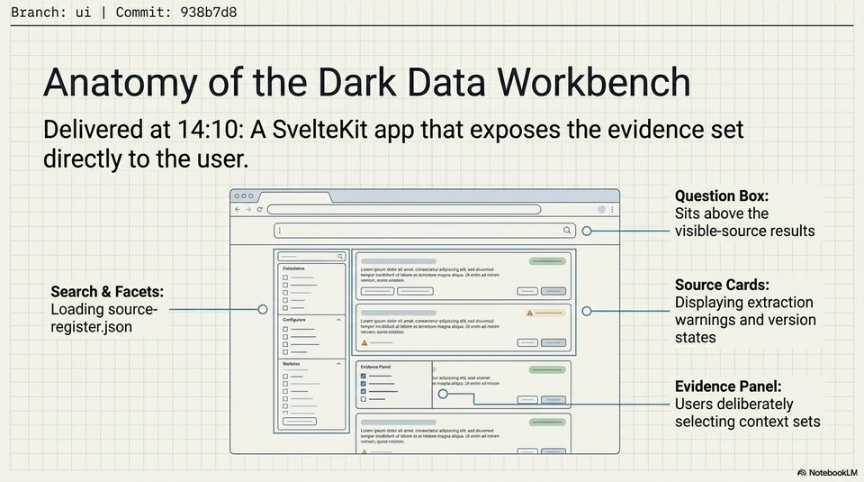

<!-- Generated by research/hmrc-beyond-hype/tools/build_narrative_sidecars.py. -->
---
source_id: dark-data-blueprint
source_file: "research/hmrc-beyond-hype/import/Dark_Data_Blueprint.pptx"
item_type: pptx-slide
item_number: 9
asset: "assets/visuals/dark-data-blueprint/slide-09.jpg"
publication_status: "publishable derived thumbnail and text sidecar; raw imported PowerPoint remains local"
tags:
  - auditability
  - challenge-2
  - dark-data
  - mcp
  - provenance
  - traceability
---

# Dark Data Blueprint - Slide 09



## Visual Description

This is slide 09 from `research/hmrc-beyond-hype/import/Dark_Data_Blueprint.pptx`. It is represented here by a small derived image so the narrative can be browsed on GitHub without publishing the raw import file.

## Claim Or Narrative Function

Explains the Challenge 2 architecture and why provenance, source preservation, and inspectable Markdown traces matter more than fluent answers alone.

## Material Points Illustrated

- Branch: ui | Commit: 938b7d8
- Anatomy of the Dark Data Workbench
- Delivered at 14:10: A SvelteKit app that exposes the evidence set
- directly to the user.
- 202 gp Question Box:
- Sits above the
- Loading source- o ||s= == Displaying extraction
- register,json warnings and version
- a oes states
- 8 - - Users deliberately
- selecting context sets


## Related Narrative Links

- [Narrative arc](../../narrative-arc.md)
- [Topic index](../../topics.md)
- [Source material index](../../source-materials.md)
- [06 Repo Case Study Codex Build](../../../06_repo_case_study_codex_build.md)
- [Architecture](../../../../../challenge-2/wiki/architecture.md)
- [Index](../../../../../challenge-2/wiki/index.md)
- [Challenge 2 worked example](../../notes/challenge-2-worked-example.md)

## Publication Status

publishable derived thumbnail and text sidecar; raw imported PowerPoint remains local.

## Caveats

- Automated OCR from an image-only PowerPoint slide; verify exact wording before quoting.

## Extracted Visual Text

```text
Branch: ui | Commit: 938b7d8
Anatomy of the Dark Data Workbench
Delivered at 14:10: A SvelteKit app that exposes the evidence set
directly to the user.
(202 gp Question Box:
Sits above the
Loading source- o ||s= == Displaying extraction
register,json warnings and version
- a oes states
8 - - Users deliberately
== selecting context sets
```
