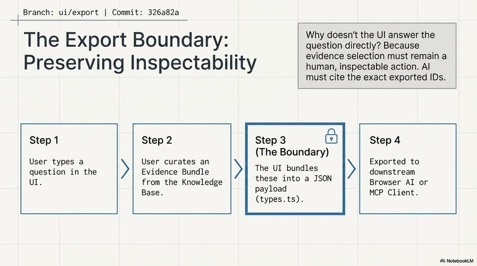

<!-- Generated by research/hmrc-beyond-hype/tools/build_narrative_sidecars.py. -->
---
source_id: dark-data-blueprint
source_file: "research/hmrc-beyond-hype/import/Dark_Data_Blueprint.pptx"
item_type: pptx-slide
item_number: 10
asset: "assets/visuals/dark-data-blueprint/slide-10.jpg"
publication_status: "publishable derived thumbnail and text sidecar; raw imported PowerPoint remains local"
tags:
  - auditability
  - challenge-2
  - dark-data
  - mcp
  - provenance
  - risk-boundaries
  - traceability
---

# Dark Data Blueprint - Slide 10



## Visual Description

This is slide 10 from `research/hmrc-beyond-hype/import/Dark_Data_Blueprint.pptx`. It is represented here by a small derived image so the narrative can be browsed on GitHub without publishing the raw import file.

## Claim Or Narrative Function

Explains the Challenge 2 architecture and why provenance, source preservation, and inspectable Markdown traces matter more than fluent answers alone.

## Material Points Illustrated

- Branch: ui/export | Commit: 326a82a
- e Why doesn't the UI answer the
- The Export Bou ndary: question directly? Because
- O one evidence selection must remain a
- Preserving Inspectability human, inspectable action. Al
- must cite the exact exported IDs.
- Step 1 Step 2 Step 3 ca) Step 4
- The Boundary)
- User types a User curates an Exported to
- question in the Evidence Bundle The UI bundles downstream
- UL. from the Knowledge these into a JSON Browser AI or
- Base. payload MCP Client.
- types.ts).
- A\ NotebookLV

## Related Narrative Links

- [Narrative arc](../../narrative-arc.md)
- [Topic index](../../topics.md)
- [Source material index](../../source-materials.md)
- [06 Repo Case Study Codex Build](../../../06_repo_case_study_codex_build.md)
- [Architecture](../../../../../challenge-2/wiki/architecture.md)
- [Index](../../../../../challenge-2/wiki/index.md)

## Publication Status

publishable derived thumbnail and text sidecar; raw imported PowerPoint remains local.

## Caveats

- Automated OCR from an image-only PowerPoint slide; verify exact wording before quoting.

## Extracted Visual Text

```text
Branch: ui/export | Commit: 326a82a
OO
e Why doesn't the UI answer the
The Export Bou ndary: question directly? Because
O one evidence selection must remain a
Preserving Inspectability human, inspectable action. Al
must cite the exact exported IDs.
Step 1 Step 2 Step 3 ca) Step 4
(The Boundary)
User types a User curates an Exported to
question in the Evidence Bundle The UI bundles downstream
UL. from the Knowledge these into a JSON Browser AI or
Base. payload MCP Client.
(types.ts).
'A\ NotebookLV
```
