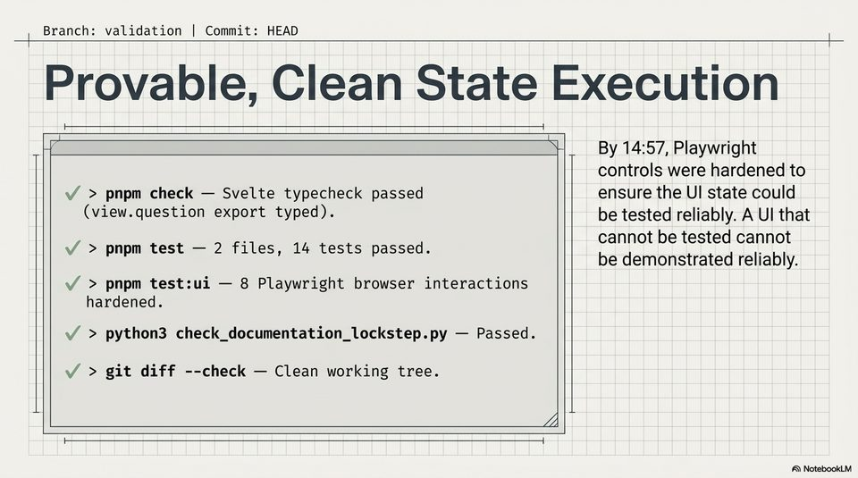

<!-- Generated by research/hmrc-beyond-hype/tools/build_narrative_sidecars.py. -->
---
source_id: dark-data-blueprint
source_file: "research/hmrc-beyond-hype/import/Dark_Data_Blueprint.pptx"
item_type: pptx-slide
item_number: 11
asset: "assets/visuals/dark-data-blueprint/slide-11.jpg"
publication_status: "publishable derived thumbnail and text sidecar; raw imported PowerPoint remains local"
tags:
  - auditability
  - challenge-2
  - dark-data
  - documentation
  - governance
  - mcp
  - provenance
  - review
  - testing
  - traceability
  - validation
---

# Dark Data Blueprint - Slide 11



## Visual Description

This is slide 11 from `research/hmrc-beyond-hype/import/Dark_Data_Blueprint.pptx`. It is represented here by a small derived image so the narrative can be browsed on GitHub without publishing the raw import file.

## Claim Or Narrative Function

Explains the Challenge 2 architecture and why provenance, source preservation, and inspectable Markdown traces matter more than fluent answers alone.

## Material Points Illustrated

- Branch: validation | Commit: HEAD
- Provable, Clean State Execution
- i ee ee eee
- By 14:57, Playwright
- controls were hardened to
- V > pnpm check - Svelte typecheck passed ensure the UI state could
- view.question export typed). be tested reliably. A UI that
- 4 cannot be tested cannot
- t - 2 files, 14 test d. L
- boonies a mc be demonstrated reliably.
- V > pnpm test:ui - 8 Playwright browser interactions
- hardened.
- V > python3 check_documentation_lockstep.py - Passed.
- V > git diff --check - Clean working tree.
- A\ NotebookLV


## Related Narrative Links

- [Narrative arc](../../narrative-arc.md)
- [Topic index](../../topics.md)
- [Source material index](../../source-materials.md)
- [06 Repo Case Study Codex Build](../../../06_repo_case_study_codex_build.md)
- [Architecture](../../../../../challenge-2/wiki/architecture.md)
- [Index](../../../../../challenge-2/wiki/index.md)

## Publication Status

publishable derived thumbnail and text sidecar; raw imported PowerPoint remains local.

## Caveats

- Automated OCR from an image-only PowerPoint slide; verify exact wording before quoting.

## Extracted Visual Text

```text
Branch: validation | Commit: HEAD
a
Provable, Clean State Execution
i ee ee eee
By 14:57, Playwright
controls were hardened to
V > pnpm check - Svelte typecheck passed ensure the UI state could
(view.question export typed). be tested reliably. A UI that
'4 cannot be tested cannot
> t - 2 files, 14 test d. L
boonies a mc be demonstrated reliably.
V > pnpm test:ui - 8 Playwright browser interactions
hardened.
V > python3 check_documentation_lockstep.py - Passed.
V > git diff --check - Clean working tree.
LZ
i
'A\ NotebookLV
```
