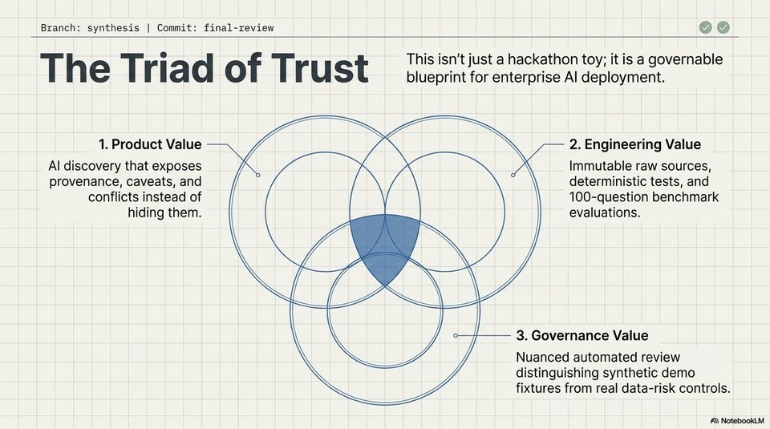

<!-- Generated by research/hmrc-beyond-hype/tools/build_narrative_sidecars.py. -->
---
source_id: dark-data-blueprint
source_file: "research/hmrc-beyond-hype/import/Dark_Data_Blueprint.pptx"
item_type: pptx-slide
item_number: 12
asset: "assets/visuals/dark-data-blueprint/slide-12.jpg"
publication_status: "publishable derived thumbnail and text sidecar; raw imported PowerPoint remains local"
tags:
  - auditability
  - challenge-2
  - dark-data
  - evaluation
  - governance
  - mcp
  - operations
  - provenance
  - review
  - risk-boundaries
  - testing
  - traceability
  - validation
---

# Dark Data Blueprint - Slide 12



## Visual Description

This is slide 12 from `research/hmrc-beyond-hype/import/Dark_Data_Blueprint.pptx`. It is represented here by a small derived image so the narrative can be browsed on GitHub without publishing the raw import file.

## Claim Or Narrative Function

Explains the Challenge 2 architecture and why provenance, source preservation, and inspectable Markdown traces matter more than fluent answers alone.

## Material Points Illustrated

- Branch: synthesis | Commit: final-review (Vv)
- Th T 7 d f Ti t This isn't just a hackathon toy; it is a governable
- e ria fe] rus blueprint for enterprise Al deployment.
- 1. Product Value 2. Engineering Value
- Al discovery that exposes Immutable raw sources,
- provenance, caveats, and deterministic tests, and
- conflicts instead of 100-question benchmark
- hiding them. evaluations.
- 3. Governance Value
- Nuanced automated review
- distinguishing synthetic demo
- fixtures from real data-risk controls.
- A\ NotebookLV


## Related Narrative Links

- [Narrative arc](../../narrative-arc.md)
- [Topic index](../../topics.md)
- [Source material index](../../source-materials.md)
- [06 Repo Case Study Codex Build](../../../06_repo_case_study_codex_build.md)
- [Architecture](../../../../../challenge-2/wiki/architecture.md)
- [Index](../../../../../challenge-2/wiki/index.md)
- [Challenge 2 worked example](../../notes/challenge-2-worked-example.md)

## Publication Status

publishable derived thumbnail and text sidecar; raw imported PowerPoint remains local.

## Caveats

- Automated OCR from an image-only PowerPoint slide; verify exact wording before quoting.

## Extracted Visual Text

```text
Branch: synthesis | Commit: final-review (Vv)
Th T 7 d f Ti t This isn't just a hackathon toy; it is a governable
e ria fe] rus blueprint for enterprise Al deployment.
1. Product Value 2. Engineering Value
Al discovery that exposes Immutable raw sources,
provenance, caveats, and deterministic tests, and
conflicts instead of 100-question benchmark
hiding them. evaluations.
3. Governance Value
Nuanced automated review
distinguishing synthetic demo
fixtures from real data-risk controls.
'A\ NotebookLV
```
