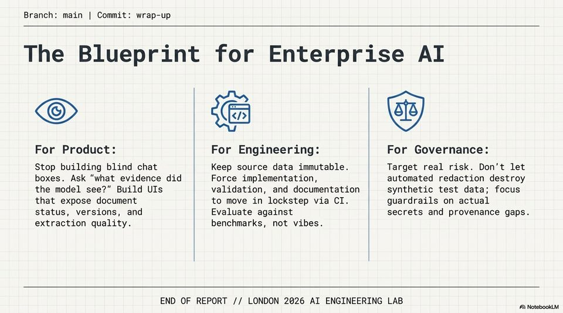

<!-- Generated by research/hmrc-beyond-hype/tools/build_narrative_sidecars.py. -->
---
source_id: dark-data-blueprint
source_file: "research/hmrc-beyond-hype/import/Dark_Data_Blueprint.pptx"
item_type: pptx-slide
item_number: 13
asset: "assets/visuals/dark-data-blueprint/slide-13.jpg"
publication_status: "publishable derived thumbnail and text sidecar; raw imported PowerPoint remains local"
tags:
  - auditability
  - build
  - challenge-2
  - dark-data
  - documentation
  - evaluation
  - governance
  - mcp
  - provenance
  - review
  - risk-boundaries
  - testing
  - traceability
  - validation
---

# Dark Data Blueprint - Slide 13



## Visual Description

This is slide 13 from `research/hmrc-beyond-hype/import/Dark_Data_Blueprint.pptx`. It is represented here by a small derived image so the narrative can be browsed on GitHub without publishing the raw import file.

## Claim Or Narrative Function

Explains the Challenge 2 architecture and why provenance, source preservation, and inspectable Markdown traces matter more than fluent answers alone.

## Material Points Illustrated

- Branch: main | Commit: wrap-up
- The Blueprint for Enterprise AI
- For Product: For Engineering: For Governance:
- Stop building blind chat Keep source data immutable. Target real risk. Don't let
- boxes. Ask "what evidence did Force implementation, automated redaction destroy
- the model see?" Build UIs validation, and documentation synthetic test data; focus
- that expose document to move in lockstep via CI. guardrails on actual
- status, versions, and Evaluate against secrets and provenance gaps.
- extraction quality. benchmarks, not vibes.
- END OF REPORT // LONDON 2026 AI ENGINEERING LAB
- A) NotebookLM


## Related Narrative Links

- [Narrative arc](../../narrative-arc.md)
- [Topic index](../../topics.md)
- [Source material index](../../source-materials.md)
- [06 Repo Case Study Codex Build](../../../06_repo_case_study_codex_build.md)
- [Architecture](../../../../../challenge-2/wiki/architecture.md)
- [Index](../../../../../challenge-2/wiki/index.md)

## Publication Status

publishable derived thumbnail and text sidecar; raw imported PowerPoint remains local.

## Caveats

- Automated OCR from an image-only PowerPoint slide; verify exact wording before quoting.

## Extracted Visual Text

```text
Branch: main | Commit: wrap-up
The Blueprint for Enterprise AI
XG
For Product: For Engineering: For Governance:
Stop building blind chat Keep source data immutable. Target real risk. Don't let
boxes. Ask "what evidence did Force implementation, automated redaction destroy
the model see?" Build UIs validation, and documentation synthetic test data; focus
that expose document to move in lockstep via CI. guardrails on actual
status, versions, and Evaluate against secrets and provenance gaps.
extraction quality. benchmarks, not vibes.
END OF REPORT // LONDON 2026 AI ENGINEERING LAB
A) NotebookLM
```
