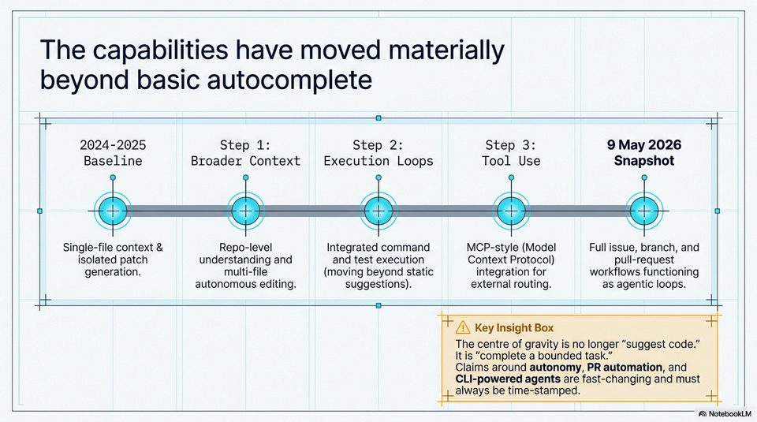

<!-- Generated by research/hmrc-beyond-hype/tools/build_narrative_sidecars.py. -->
---
source_id: governing-ai-engineering
source_file: "research/hmrc-beyond-hype/import/Governing_AI_Engineering.pptx"
item_type: pptx-slide
item_number: 2
asset: "assets/visuals/governing-ai-engineering/slide-02.jpg"
publication_status: "publishable derived thumbnail and text sidecar; raw imported PowerPoint remains local"
tags:
  - agentic-coding
  - governance
  - hmrc
  - mcp
  - public-sector
  - risk-boundaries
  - security
  - validation
---

# Governing AI Engineering - Slide 02



## Visual Description

This is slide 02 from `research/hmrc-beyond-hype/import/Governing_AI_Engineering.pptx`. It is represented here by a small derived image so the narrative can be browsed on GitHub without publishing the raw import file.

## Claim Or Narrative Function

Sets the public-sector control frame: AI coding agents can accelerate work, but assurance, security sign-off, and policy ownership remain human and institutional duties.

## Material Points Illustrated

- im HI
- 2024-2025 Step 1: Step 2: Step 3: 9 May 2026
- Baseline Broader Context Execution Loops Tool Use Snapshot
- Single-file context & Repo-level Integrated command MCP-style (Model Full issue, branch, and
- isolated patch understanding and and test execution Context Protocol) pull-request
- generation. multi-file (moving beyond static integration for workflows functioning
- autonomous editing. suggestions). external routing. as agentic loops.
- q oI
- Z\ Key Insight Box
- The centre of gravity is no longer "suggest code."
- It is "complete a bounded task."
- Claims around autonomy, PR automation, and
- CLI-powered agents are fast-changing and must
- 4 always be time-stamped. H
- A) NotebookLM

## Related Narrative Links

- [Narrative arc](../../narrative-arc.md)
- [Topic index](../../topics.md)
- [Source material index](../../source-materials.md)
- [05 Security Governance Public Sector](../../../05_security_governance_public_sector.md)
- [07 Operating Model For Public Sector Engineering](../../../07_operating_model_for_public_sector_engineering.md)
- [Governing Agentic Ai In Software Engineering.Speakers](../../../transcripts/governing-agentic-ai-in-software-engineering.speakers.md)

## Publication Status

publishable derived thumbnail and text sidecar; raw imported PowerPoint remains local.

## Caveats

- Automated OCR from an image-only PowerPoint slide; verify exact wording before quoting.

## Extracted Visual Text

```text
im HI
2024-2025 Step 1: Step 2: Step 3: 9 May 2026
Baseline Broader Context Execution Loops Tool Use Snapshot
Single-file context & Repo-level Integrated command MCP-style (Model Full issue, branch, and
isolated patch understanding and and test execution Context Protocol) pull-request
generation. multi-file (moving beyond static integration for workflows functioning
autonomous editing. suggestions). external routing. as agentic loops.
Ho
q oI
Z\ Key Insight Box
The centre of gravity is no longer "suggest code."
It is "complete a bounded task."
Claims around autonomy, PR automation, and
CLI-powered agents are fast-changing and must
4 always be time-stamped. H
A) NotebookLM
```
