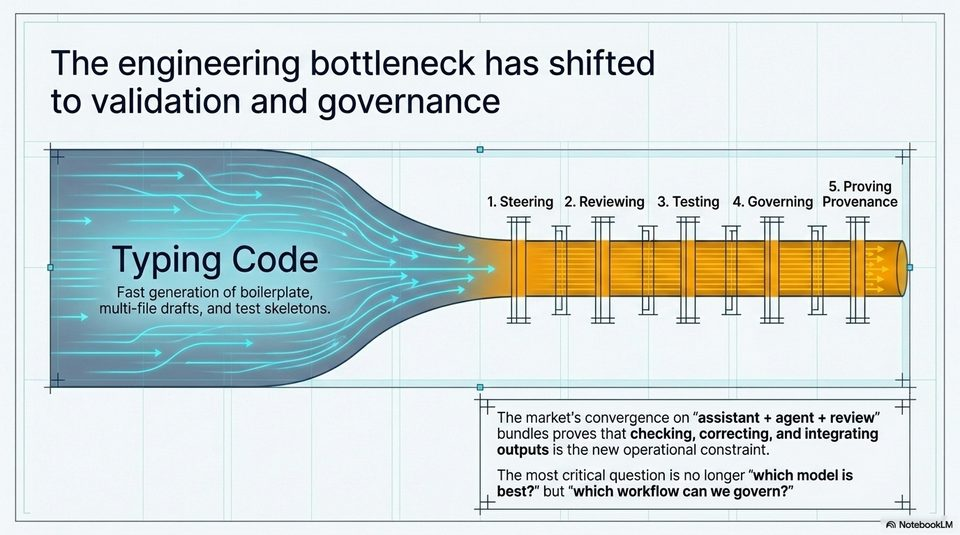

<!-- Generated by research/hmrc-beyond-hype/tools/build_narrative_sidecars.py. -->
---
source_id: governing-ai-engineering
source_file: "research/hmrc-beyond-hype/import/Governing_AI_Engineering.pptx"
item_type: pptx-slide
item_number: 3
asset: "assets/visuals/governing-ai-engineering/slide-03.jpg"
publication_status: "publishable derived thumbnail and text sidecar; raw imported PowerPoint remains local"
tags:
  - agentic-coding
  - ai-assistants
  - governance
  - hmrc
  - provenance
  - public-sector
  - risk-boundaries
  - security
  - validation
---

# Governing AI Engineering - Slide 03



## Visual Description

This is slide 03 from `research/hmrc-beyond-hype/import/Governing_AI_Engineering.pptx`. It is represented here by a small derived image so the narrative can be browsed on GitHub without publishing the raw import file.

## Claim Or Narrative Function

Sets the public-sector control frame: AI coding agents can accelerate work, but assurance, security sign-off, and policy ownership remain human and institutional duties.

## Material Points Illustrated

- The engineering bottleneck has shifted
- to validation and governance
- 5. Proving
- 1.Steering 2.Reviewing 3.Testing 4.Governing Provenance
- Lae iL aie ae
- Typing Code
- Fast generation of boilerplate,
- Hy r
- The market's convergence on "assistant + agent + review"
- bundles proves that checking, correcting, and integrating
- outputs is the new operational constraint.
- The most critical question is no longer "which model is
- best?" but "which workflow can we govern?"
- A) NotebookLM

## Related Narrative Links

- [Narrative arc](../../narrative-arc.md)
- [Topic index](../../topics.md)
- [Source material index](../../source-materials.md)
- [05 Security Governance Public Sector](../../../05_security_governance_public_sector.md)
- [07 Operating Model For Public Sector Engineering](../../../07_operating_model_for_public_sector_engineering.md)
- [Governing Agentic Ai In Software Engineering.Speakers](../../../transcripts/governing-agentic-ai-in-software-engineering.speakers.md)

## Publication Status

publishable derived thumbnail and text sidecar; raw imported PowerPoint remains local.

## Caveats

- Automated OCR from an image-only PowerPoint slide; verify exact wording before quoting.

## Extracted Visual Text

```text
The engineering bottleneck has shifted
to validation and governance
+
5. Proving
1.Steering 2.Reviewing 3.Testing 4.Governing Provenance
Lae iL aie ae
Typing Code
Fast generation of boilerplate,
a
Hy r
The market's convergence on "assistant + agent + review"
bundles proves that checking, correcting, and integrating
outputs is the new operational constraint.
The most critical question is no longer "which model is
best?" but "which workflow can we govern?"
4 a
A) NotebookLM
```
