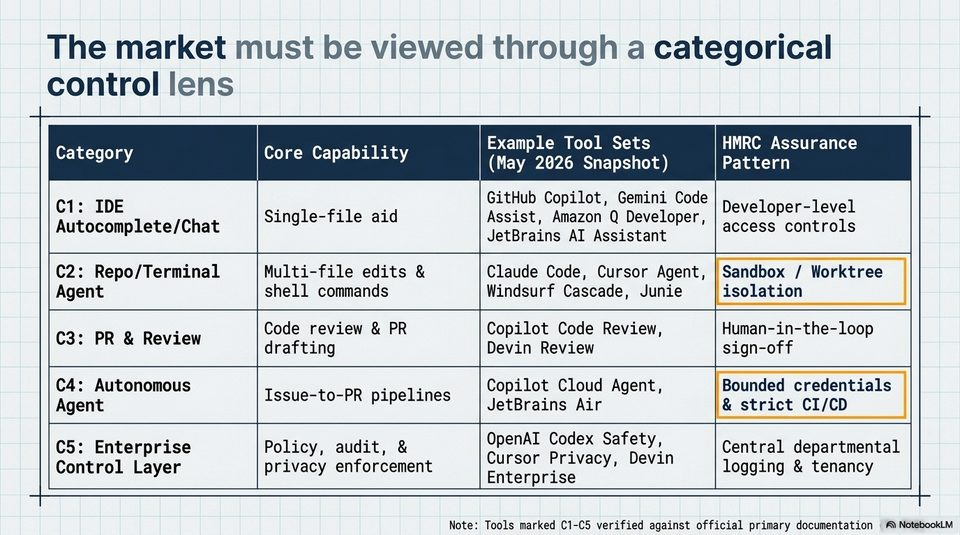

<!-- Generated by research/hmrc-beyond-hype/tools/build_narrative_sidecars.py. -->
---
source_id: governing-ai-engineering
source_file: "research/hmrc-beyond-hype/import/Governing_AI_Engineering.pptx"
item_type: pptx-slide
item_number: 4
asset: "assets/visuals/governing-ai-engineering/slide-04.jpg"
publication_status: "publishable derived thumbnail and text sidecar; raw imported PowerPoint remains local"
tags:
  - agentic-coding
  - ai-assistants
  - auditability
  - build
  - documentation
  - governance
  - hmrc
  - public-sector
  - review
  - risk-boundaries
  - rollout
  - security
  - validation
---

# Governing AI Engineering - Slide 04



## Visual Description

This is slide 04 from `research/hmrc-beyond-hype/import/Governing_AI_Engineering.pptx`. It is represented here by a small derived image so the narrative can be browsed on GitHub without publishing the raw import file.

## Claim Or Narrative Function

Sets the public-sector control frame: AI coding agents can accelerate work, but assurance, security sign-off, and policy ownership remain human and institutional duties.

## Material Points Illustrated

- The market must be viewed through a categorical
- control lens
- Soe Example Tool Sets HMRC Assurance
- CARTIY COneRC op aUa LLY) (May 2826 Snapshot) Pattern
- GitHub Copilot, Gemini Code
- C1: IDE i 'iFA 0 Developer-level
- Single-file aid Assist, Amazon Q Developer,
- Autocomplete/Chat JetBrains AI Assistant access controls
- C2: Repo/Terminal Multi-file edits & Claude Code, Cursor Agent, | Sandbox / Worktree
- Agent shell commands Windsurf Cascade, Junie isolation
- if a Code review & PR Copilot Code Review, Human-in-the-loop
- C3: PR & Review drafting Devin Review sign-off
- C4: Autonomous Aa a4 Copilot Cloud Agent, Bounded credentials
- ssUet Og Rapipelines JetBrains Air & strict CI/CD
- C5: Enterprise Policy, audit, & a he Pee peak Central departmental
- Control Layer privacy enforcement Enterprise logging & tenancy
- Note: Tools marked C1-C5 verified against official primary documentation | A) NotebookLM


## Related Narrative Links

- [Narrative arc](../../narrative-arc.md)
- [Topic index](../../topics.md)
- [Source material index](../../source-materials.md)
- [05 Security Governance Public Sector](../../../05_security_governance_public_sector.md)
- [07 Operating Model For Public Sector Engineering](../../../07_operating_model_for_public_sector_engineering.md)
- [Governing Agentic Ai In Software Engineering.Speakers](../../../transcripts/governing-agentic-ai-in-software-engineering.speakers.md)

## Publication Status

publishable derived thumbnail and text sidecar; raw imported PowerPoint remains local.

## Caveats

- Automated OCR from an image-only PowerPoint slide; verify exact wording before quoting.

## Extracted Visual Text

```text
The market must be viewed through a categorical
control lens
Soe Example Tool Sets HMRC Assurance
CARTIY COneRC op aUa LLY) (May 2826 Snapshot) Pattern
GitHub Copilot, Gemini Code
C1: IDE i 'iFA 0 Developer-level
Single-file aid Assist, Amazon Q Developer,
Autocomplete/Chat JetBrains AI Assistant access controls
C2: Repo/Terminal Multi-file edits & Claude Code, Cursor Agent, | Sandbox / Worktree
Agent shell commands Windsurf Cascade, Junie isolation
if a Code review & PR Copilot Code Review, Human-in-the-loop
C3: PR & Review drafting Devin Review sign-off
C4: Autonomous Aa a4 Copilot Cloud Agent, Bounded credentials |
ssUet Og Rapipelines JetBrains Air & strict CI/CD
C5: Enterprise Policy, audit, & a he Pee peak Central departmental
Control Layer privacy enforcement Enterprise logging & tenancy
Note: Tools marked C1-C5 verified against official primary documentation | A) NotebookLM
```
