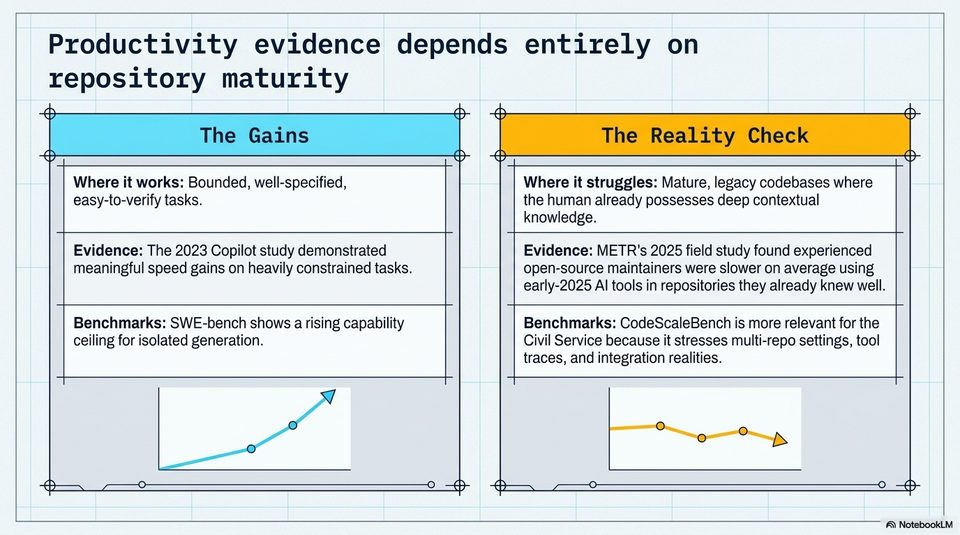

<!-- Generated by research/hmrc-beyond-hype/tools/build_narrative_sidecars.py. -->
---
source_id: governing-ai-engineering
source_file: "research/hmrc-beyond-hype/import/Governing_AI_Engineering.pptx"
item_type: pptx-slide
item_number: 5
asset: "assets/visuals/governing-ai-engineering/slide-05.jpg"
publication_status: "publishable derived thumbnail and text sidecar; raw imported PowerPoint remains local"
tags:
  - ai-assistants
  - auditability
  - build
  - challenge-2
  - dark-data
  - evaluation
  - governance
  - hmrc
  - operations
  - public-sector
  - review
  - risk-boundaries
  - security
  - validation
---

# Governing AI Engineering - Slide 05



## Visual Description

This is slide 05 from `research/hmrc-beyond-hype/import/Governing_AI_Engineering.pptx`. It is represented here by a small derived image so the narrative can be browsed on GitHub without publishing the raw import file.

## Claim Or Narrative Function

Sets the public-sector control frame: AI coding agents can accelerate work, but assurance, security sign-off, and policy ownership remain human and institutional duties.

## Material Points Illustrated

- Productivity evidence depends entirely on
- repository maturity
- Where it works: Bounded, well-specified, Where it struggles: Mature, legacy codebases where
- easy-to-verify tasks. the human already possesses deep contextual
- knowledge.
- Evidence: The 2023 Copilot study demonstrated Evidence: METR's 2025 field study found experienced
- meaningful speed gains on heavily constrained tasks. open-source maintainers were slower on average using
- early-2025 Al tools in repositories they already knew well.
- Benchmarks: SWE-bench shows a rising capability Benchmarks: CodeScaleBench is more relevant for the
- ceiling for isolated generation. Civil Service because it stresses multi-repo settings, tool
- traces, and integration realities.
- A) NotebookLM


## Related Narrative Links

- [Narrative arc](../../narrative-arc.md)
- [Topic index](../../topics.md)
- [Source material index](../../source-materials.md)
- [05 Security Governance Public Sector](../../../05_security_governance_public_sector.md)
- [07 Operating Model For Public Sector Engineering](../../../07_operating_model_for_public_sector_engineering.md)
- [Governing Agentic Ai In Software Engineering.Speakers](../../../transcripts/governing-agentic-ai-in-software-engineering.speakers.md)

## Publication Status

publishable derived thumbnail and text sidecar; raw imported PowerPoint remains local.

## Caveats

- Automated OCR from an image-only PowerPoint slide; verify exact wording before quoting.

## Extracted Visual Text

```text
Productivity evidence depends entirely on
repository maturity
Where it works: Bounded, well-specified, Where it struggles: Mature, legacy codebases where
easy-to-verify tasks. the human already possesses deep contextual
knowledge.
Evidence: The 2023 Copilot study demonstrated Evidence: METR's 2025 field study found experienced
meaningful speed gains on heavily constrained tasks. open-source maintainers were slower on average using
early-2025 Al tools in repositories they already knew well.
Benchmarks: SWE-bench shows a rising capability Benchmarks: CodeScaleBench is more relevant for the
ceiling for isolated generation. Civil Service because it stresses multi-repo settings, tool
traces, and integration realities.
A) NotebookLM
```
