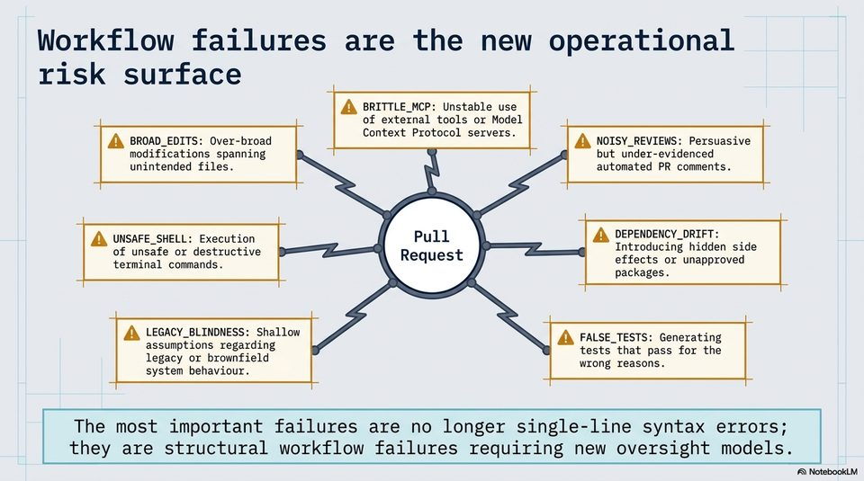

<!-- Generated by research/hmrc-beyond-hype/tools/build_narrative_sidecars.py. -->
---
source_id: governing-ai-engineering
source_file: "research/hmrc-beyond-hype/import/Governing_AI_Engineering.pptx"
item_type: pptx-slide
item_number: 6
asset: "assets/visuals/governing-ai-engineering/slide-06.jpg"
publication_status: "publishable derived thumbnail and text sidecar; raw imported PowerPoint remains local"
tags:
  - agentic-coding
  - auditability
  - governance
  - hmrc
  - planning
  - public-sector
  - review
  - risk-boundaries
  - security
  - testing
  - validation
---

# Governing AI Engineering - Slide 06



## Visual Description

This is slide 06 from `research/hmrc-beyond-hype/import/Governing_AI_Engineering.pptx`. It is represented here by a small derived image so the narrative can be browsed on GitHub without publishing the raw import file.

## Claim Or Narrative Function

Sets the public-sector control frame: AI coding agents can accelerate work, but assurance, security sign-off, and policy ownership remain human and institutional duties.

## Material Points Illustrated

- Workflow failures are the new operational
- risk surface
- of external tools or Model
- Ad BROAD_EDITS: Over-broad CHESS ESM CORTE AQ NoIsy_REVIEWS: Persuasive
- modifications spanning but under-evidenced
- unintended files. automated PR comments.
- UNSAFE_SHELL: Execution Pull AQ DEPENDENCY_DRIFT:
- a of unsafe or destructive Request Introducing hidden side
- terminalicommandel effects or unapproved
- packages.
- AQ LEGACY BLINDNESS: Shallow AQ FALSE_TESTS: Generating
- aaa nT Lorre card ie tests that pass for the
- legacy or brownfield cao] Sew
- system behaviour. .
- The most important failures are no longer single-line syntax errors;
- they are structural workflow failures requiring new oversight models.
- A\ NotebookLV


## Related Narrative Links

- [Narrative arc](../../narrative-arc.md)
- [Topic index](../../topics.md)
- [Source material index](../../source-materials.md)
- [05 Security Governance Public Sector](../../../05_security_governance_public_sector.md)
- [07 Operating Model For Public Sector Engineering](../../../07_operating_model_for_public_sector_engineering.md)
- [Governing Agentic Ai In Software Engineering.Speakers](../../../transcripts/governing-agentic-ai-in-software-engineering.speakers.md)

## Publication Status

publishable derived thumbnail and text sidecar; raw imported PowerPoint remains local.

## Caveats

- Automated OCR from an image-only PowerPoint slide; verify exact wording before quoting.

## Extracted Visual Text

```text
Workflow failures are the new operational
risk surface
of external tools or Model
Ad BROAD_EDITS: Over-broad CHESS ESM CORTE AQ NoIsy_REVIEWS: Persuasive
modifications spanning but under-evidenced
unintended files. automated PR comments.
UNSAFE_SHELL: Execution Pull AQ DEPENDENCY_DRIFT:
a of unsafe or destructive Request Introducing hidden side
terminalicommandel effects or unapproved
packages.
AQ LEGACY BLINDNESS: Shallow AQ FALSE_TESTS: Generating
aaa nT Lorre card ie tests that pass for the
legacy or brownfield cao] Sew
system behaviour. .
The most important failures are no longer single-line syntax errors;
they are structural workflow failures requiring new oversight models.
'A\ NotebookLV
```
