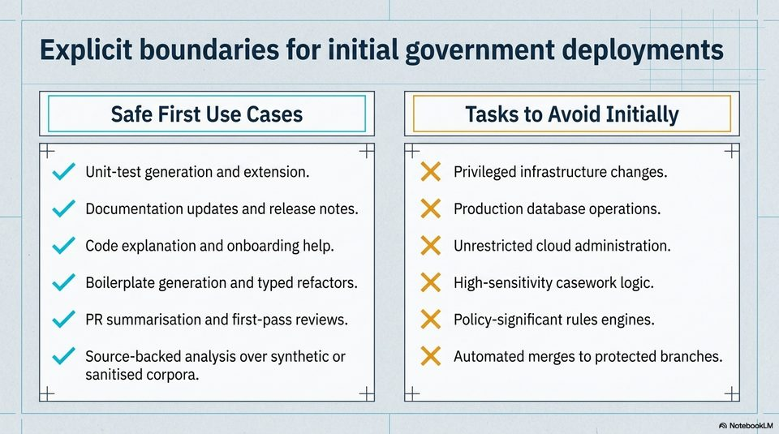

<!-- Generated by research/hmrc-beyond-hype/tools/build_narrative_sidecars.py. -->
---
source_id: governing-ai-engineering
source_file: "research/hmrc-beyond-hype/import/Governing_AI_Engineering.pptx"
item_type: pptx-slide
item_number: 8
asset: "assets/visuals/governing-ai-engineering/slide-08.jpg"
publication_status: "publishable derived thumbnail and text sidecar; raw imported PowerPoint remains local"
tags:
  - build
  - dark-data
  - documentation
  - governance
  - hmrc
  - operations
  - planning
  - provenance
  - public-sector
  - review
  - risk-boundaries
  - rollout
  - security
  - testing
  - validation
---

# Governing AI Engineering - Slide 08



## Visual Description

This is slide 08 from `research/hmrc-beyond-hype/import/Governing_AI_Engineering.pptx`. It is represented here by a small derived image so the narrative can be browsed on GitHub without publishing the raw import file.

## Claim Or Narrative Function

Sets the public-sector control frame: AI coding agents can accelerate work, but assurance, security sign-off, and policy ownership remain human and institutional duties.

## Material Points Illustrated

- Explicit boundaries for initial government deployments
- Safe First Use Cases Tasks to Avoid Initially
- i CT a) CT T
- A Unit-test generation and extension. x Privileged infrastructure changes.
- 4 Documentation updates and release notes. xX Production database operations.
- Code explanation and onboarding help. x Unrestricted cloud administration.
- SY Boilerplate generation and typed refactors. >< High-sensitivity casework logic.
- 4 PRsummarisation and first-pass reviews. xX Policy-significant rules engines.
- Source-backed analysis over synthetic or xX Automated merges to protected branches.
- sanitised corpora.
- CI a) Ct Ty
- rn RC es Vad en gC oe ee TEST


## Related Narrative Links

- [Narrative arc](../../narrative-arc.md)
- [Topic index](../../topics.md)
- [Source material index](../../source-materials.md)
- [05 Security Governance Public Sector](../../../05_security_governance_public_sector.md)
- [07 Operating Model For Public Sector Engineering](../../../07_operating_model_for_public_sector_engineering.md)
- [Governing Agentic Ai In Software Engineering.Speakers](../../../transcripts/governing-agentic-ai-in-software-engineering.speakers.md)

## Publication Status

publishable derived thumbnail and text sidecar; raw imported PowerPoint remains local.

## Caveats

- Automated OCR from an image-only PowerPoint slide; verify exact wording before quoting.

## Extracted Visual Text

```text
Explicit boundaries for initial government deployments
Safe First Use Cases Tasks to Avoid Initially
i CT a) CT T
| A Unit-test generation and extension. x Privileged infrastructure changes.
| <4 Documentation updates and release notes. xX Production database operations. |
|
Code explanation and onboarding help. x Unrestricted cloud administration.
|
| SY Boilerplate generation and typed refactors. >< High-sensitivity casework logic.
| <4 PRsummarisation and first-pass reviews. xX Policy-significant rules engines. |
| |
/ Source-backed analysis over synthetic or xX Automated merges to protected branches. |
sanitised corpora. |
CI a) Ct Ty |
rn RC es Vad en gC oe ee TEST
```
