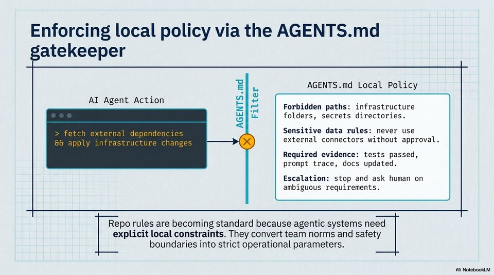

<!-- Generated by research/hmrc-beyond-hype/tools/build_narrative_sidecars.py. -->
---
source_id: governing-ai-engineering
source_file: "research/hmrc-beyond-hype/import/Governing_AI_Engineering.pptx"
item_type: pptx-slide
item_number: 9
asset: "assets/visuals/governing-ai-engineering/slide-09.jpg"
publication_status: "publishable derived thumbnail and text sidecar; raw imported PowerPoint remains local"
tags:
  - agentic-coding
  - auditability
  - governance
  - hmrc
  - public-sector
  - review
  - risk-boundaries
  - rollout
  - security
  - testing
  - validation
---

# Governing AI Engineering - Slide 09



## Visual Description

This is slide 09 from `research/hmrc-beyond-hype/import/Governing_AI_Engineering.pptx`. It is represented here by a small derived image so the narrative can be browsed on GitHub without publishing the raw import file.

## Claim Or Narrative Function

Sets the public-sector control frame: AI coding agents can accelerate work, but assurance, security sign-off, and policy ownership remain human and institutional duties.

## Material Points Illustrated

- Enforcing local policy via the AGENTS.md
- z - AGENTS.md Local Policy
- AI Agent Action ays /
- a |=} Forbidden paths: infrastructure
- a Le folders, secrets directories.
- a Sensitive data rules: never use
- external connectors without approval.
- Required evidence: tests passed,
- prompt trace, docs updated.
- Escalation: stop and ask human on
- ambiguous requirements.
- Repo rules are becoming standard because agentic systems need
- explicit local constraints. They convert team norms and safety
- boundaries into strict operational parameters.
- A) NotebookLM


## Related Narrative Links

- [Narrative arc](../../narrative-arc.md)
- [Topic index](../../topics.md)
- [Source material index](../../source-materials.md)
- [05 Security Governance Public Sector](../../../05_security_governance_public_sector.md)
- [07 Operating Model For Public Sector Engineering](../../../07_operating_model_for_public_sector_engineering.md)
- [Governing Agentic Ai In Software Engineering.Speakers](../../../transcripts/governing-agentic-ai-in-software-engineering.speakers.md)

## Publication Status

publishable derived thumbnail and text sidecar; raw imported PowerPoint remains local.

## Caveats

- Automated OCR from an image-only PowerPoint slide; verify exact wording before quoting.

## Extracted Visual Text

```text
Enforcing local policy via the AGENTS.md
z - AGENTS.md Local Policy
AI Agent Action ays /
a |=} Forbidden paths: infrastructure
a Le folders, secrets directories.
a Sensitive data rules: never use
external connectors without approval.
Required evidence: tests passed,
prompt trace, docs updated.
Escalation: stop and ask human on
ambiguous requirements.
Repo rules are becoming standard because agentic systems need
explicit local constraints. They convert team norms and safety
boundaries into strict operational parameters.
A) NotebookLM
```
