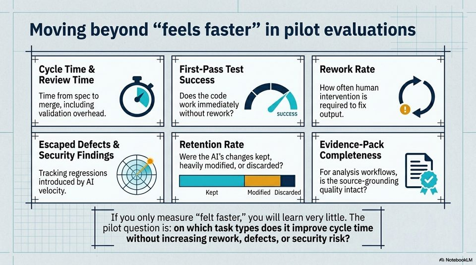

<!-- Generated by research/hmrc-beyond-hype/tools/build_narrative_sidecars.py. -->
---
source_id: governing-ai-engineering
source_file: "research/hmrc-beyond-hype/import/Governing_AI_Engineering.pptx"
item_type: pptx-slide
item_number: 10
asset: "assets/visuals/governing-ai-engineering/slide-10.jpg"
publication_status: "publishable derived thumbnail and text sidecar; raw imported PowerPoint remains local"
tags:
  - agentic-coding
  - auditability
  - build
  - dark-data
  - evaluation
  - governance
  - hmrc
  - public-sector
  - review
  - risk-boundaries
  - security
  - testing
  - validation
---

# Governing AI Engineering - Slide 10



## Visual Description

This is slide 10 from `research/hmrc-beyond-hype/import/Governing_AI_Engineering.pptx`. It is represented here by a small derived image so the narrative can be browsed on GitHub without publishing the raw import file.

## Claim Or Narrative Function

Sets the public-sector control frame: AI coding agents can accelerate work, but assurance, security sign-off, and policy ownership remain human and institutional duties.

## Material Points Illustrated

- Moving beyond "feels faster" in pilot evaluations
- 7 AqA 7
- Cycle Time & First-Pass Test Rework Rate
- Review Time Success
- GA How often human
- Time from spec to Does the code f y intervention is
- merge, including work immediately 7. required to fix 1)
- validation overhead. without rework? SUCCESS output.
- Escaped Defects & Retention Rate Evidence-Pack
- Security Findings Were the Al's changes kept, Completeness
- heavily modified, or discarded? : as
- Tracking regressions For analysis workflows, | 7%
- introduced by AI Cl | is the source-grounding =Q
- velocity. Kept Modified Discarded | } quality intact? we
- If you only measure "felt faster," you will learn very little. The
- pilot question is: on which task types does it improve cycle time
- without increasing rework, defects, or security risk?
- A\ NotebookLV


## Related Narrative Links

- [Narrative arc](../../narrative-arc.md)
- [Topic index](../../topics.md)
- [Source material index](../../source-materials.md)
- [05 Security Governance Public Sector](../../../05_security_governance_public_sector.md)
- [07 Operating Model For Public Sector Engineering](../../../07_operating_model_for_public_sector_engineering.md)
- [Governing Agentic Ai In Software Engineering.Speakers](../../../transcripts/governing-agentic-ai-in-software-engineering.speakers.md)

## Publication Status

publishable derived thumbnail and text sidecar; raw imported PowerPoint remains local.

## Caveats

- Automated OCR from an image-only PowerPoint slide; verify exact wording before quoting.

## Extracted Visual Text

```text
'6 9 e
Moving beyond "feels faster" in pilot evaluations
: 7 AqA 7
Cycle Time & First-Pass Test Rework Rate
Review Time Success
GA How often human
Time from spec to Does the code f y intervention is
merge, including work immediately 7. required to fix 1)
validation overhead. without rework? SUCCESS output.
Escaped Defects & Retention Rate Evidence-Pack
Security Findings Were the Al's changes kept, Completeness
: heavily modified, or discarded? : as
Tracking regressions For analysis workflows, | 7%
introduced by AI Cl | is the source-grounding =Q
velocity. Kept Modified Discarded | } quality intact? we
If you only measure "felt faster," you will learn very little. The
pilot question is: on which task types does it improve cycle time
without increasing rework, defects, or security risk?
'A\ NotebookLV
```
