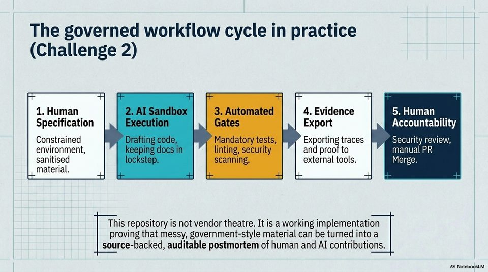

<!-- Generated by research/hmrc-beyond-hype/tools/build_narrative_sidecars.py. -->
---
source_id: governing-ai-engineering
source_file: "research/hmrc-beyond-hype/import/Governing_AI_Engineering.pptx"
item_type: pptx-slide
item_number: 11
asset: "assets/visuals/governing-ai-engineering/slide-11.jpg"
publication_status: "publishable derived thumbnail and text sidecar; raw imported PowerPoint remains local"
tags:
  - agentic-coding
  - auditability
  - challenge-2
  - dark-data
  - governance
  - hmrc
  - provenance
  - public-sector
  - risk-boundaries
  - security
  - validation
---

# Governing AI Engineering - Slide 11



## Visual Description

This is slide 11 from `research/hmrc-beyond-hype/import/Governing_AI_Engineering.pptx`. It is represented here by a small derived image so the narrative can be browsed on GitHub without publishing the raw import file.

## Claim Or Narrative Function

Sets the public-sector control frame: AI coding agents can accelerate work, but assurance, security sign-off, and policy ownership remain human and institutional duties.

## Material Points Illustrated

- The governed workflow cycle in practice
- Challenge 2)
- 1. Human , e 4. Evidence 5. Human
- Specification e eS Export Accountability
- Constrained Exporting traces Security review,
- environment, and proof to manual PR
- sanitised g external tools. Merge.
- material.
- This repository is not vendor theatre. It is a working implementation
- proving that messy, government-style material can be turned into a
- source-backed, auditable postmortem of human and Al contributions.

## Related Narrative Links

- [Narrative arc](../../narrative-arc.md)
- [Topic index](../../topics.md)
- [Source material index](../../source-materials.md)
- [05 Security Governance Public Sector](../../../05_security_governance_public_sector.md)
- [07 Operating Model For Public Sector Engineering](../../../07_operating_model_for_public_sector_engineering.md)
- [Governing Agentic Ai In Software Engineering.Speakers](../../../transcripts/governing-agentic-ai-in-software-engineering.speakers.md)

## Publication Status

publishable derived thumbnail and text sidecar; raw imported PowerPoint remains local.

## Caveats

- Automated OCR from an image-only PowerPoint slide; verify exact wording before quoting.

## Extracted Visual Text

```text
The governed workflow cycle in practice
(Challenge 2)
1. Human , e 4. Evidence 5. Human
Specification e eS Export Accountability
Constrained Exporting traces Security review,
environment, and proof to manual PR
sanitised g external tools. Merge.
material.
This repository is not vendor theatre. It is a working implementation
proving that messy, government-style material can be turned into a
source-backed, auditable postmortem of human and Al contributions.
```
